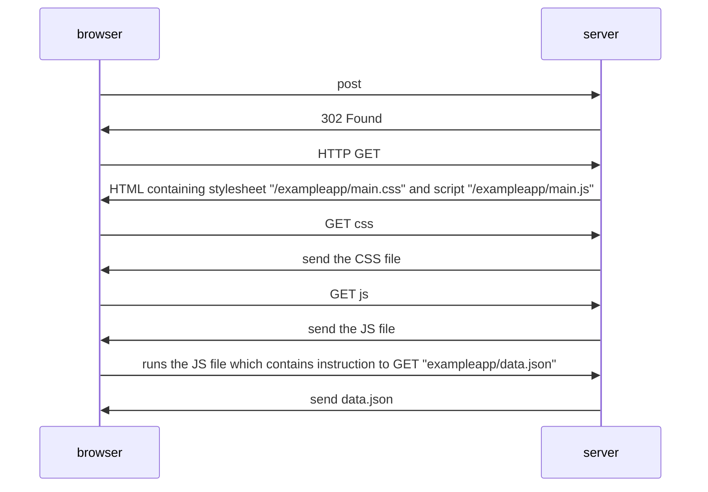

```mermaid
sequenceDiagram
    participant browser
    participant server
    browser->>server: post
    server->>browser: 302 Found
    browser->>server: HTTP GET
    server->>browser: HTML containing stylesheet "/exampleapp/main.css" and script "/exampleapp/main.js"
    browser->>server: GET css
    server->>browser: send the CSS file
    browser->>server: GET js
    server->>browser: send the JS file
    browser->>server: runs the JS file which contains instruction to GET "exampleapp/data.json"
    server->>browser: send data.json
```