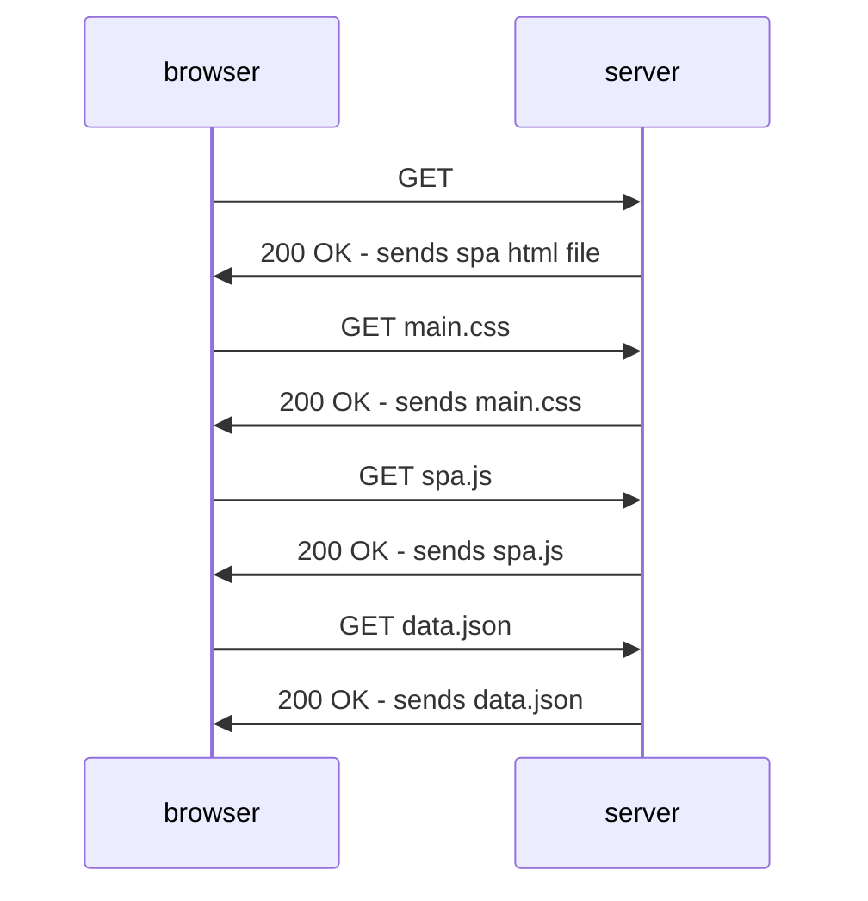

```mermaid
sequenceDiagram
    participant browser
    participant server
    browser->>server: GET 
    server->>browser: 200 OK - sends spa html file
    browser->>server: GET main.css
    server->>browser: 200 OK - sends main.css
    browser->>server: GET spa.js
    server->>browser: 200 OK - sends spa.js
    browser->>server: GET data.json
    server->>browser: 200 OK - sends data.json
``` 